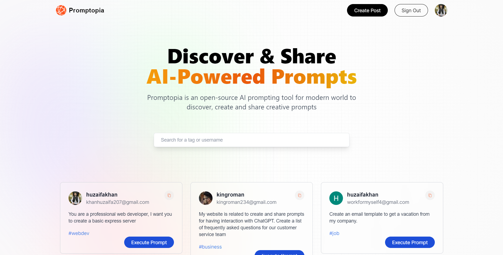
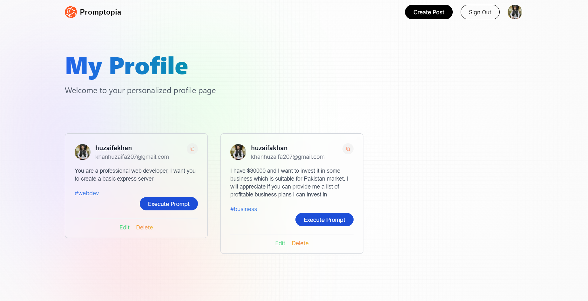
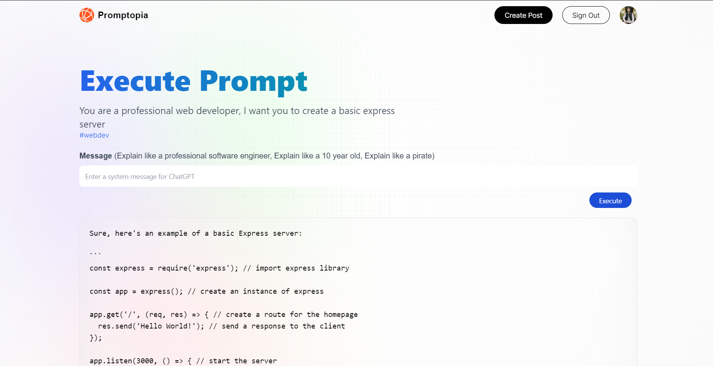

# Promptopia

A prompt sharing website built on NEXT.js  
it allows user to  
    - Create prompt  
    - Share prompt  
    - Execute prompt (to get ChatGPT response)  

Currently it is deployed on netlify and can be tested at the link below  
<https://effulgent-dieffenbachia-fc6537.netlify.app>  

## Home Page

Home will display all the prompts and option to search prompts  

## Profile Page

Profile page will show all the prompts of a specific user

## Execute Prompt Page

This page will show the prompt you want to execute, and then on execution will show the result obtained by ChatGPT response

